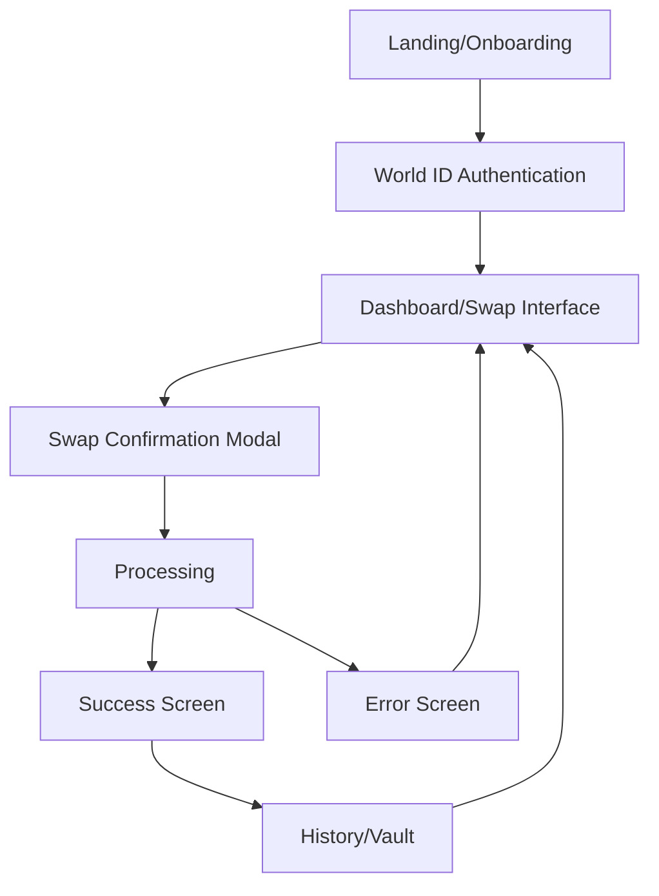
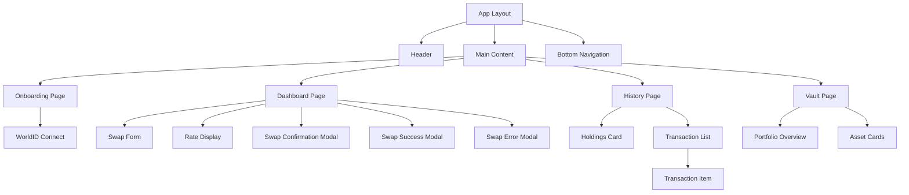
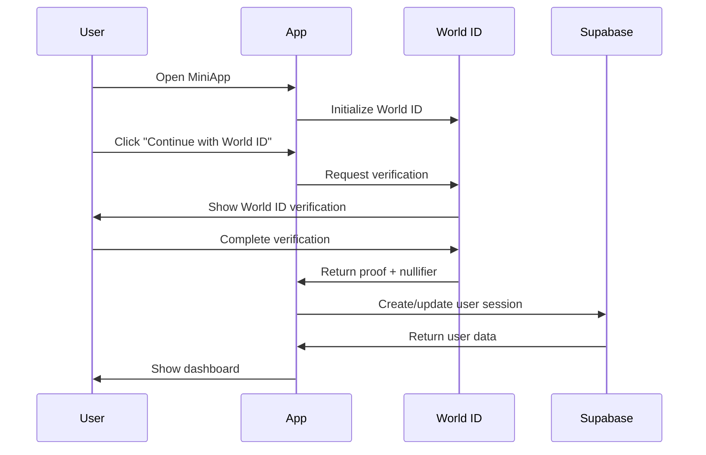
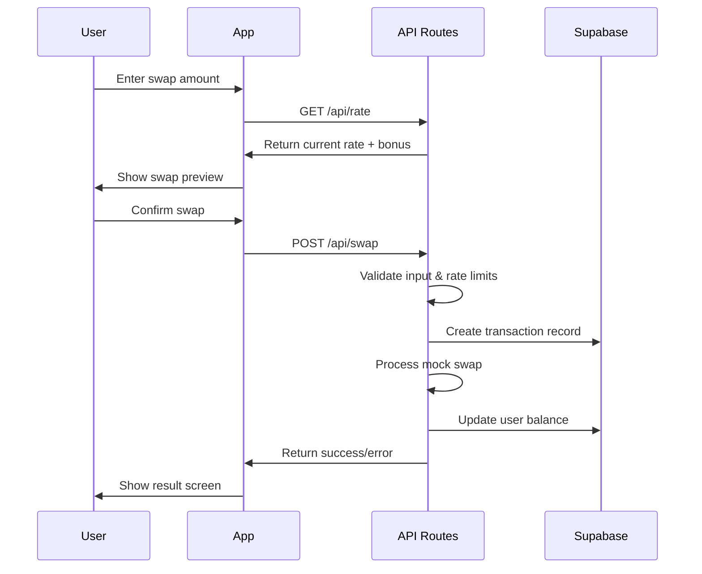

# WLD → GASH Swap MiniApp Architecture Plan

## Executive Summary

This document outlines the comprehensive architecture for a Worldcoin MiniApp that enables users to swap WLD tokens for GASH (synthetic gold-backed ERC-20 tokens). The application is designed as an MVP with mock swap functionality, targeting 100-1000 users, and will be deployed as a serverless application on the Worldcoin MiniApp platform.

## User Flow Analysis

Based on the UI designs, the application follows this user journey:



### Key Screens Identified:

1. **Onboarding** - Landing screen with "Continue with World ID"
2. **Dashboard** - Main swap interface (not shown in designs but implied)
3. **Confirmation Modal** - Swap summary with rates and bonuses
4. **Success Screen** - Transaction confirmation with details
5. **Error Screen** - Failure handling with retry option
6. **History Screen** - Transaction history and GASH holdings
7. **Vault Screen** - Portfolio management (implied from navigation)

## Recommended Tech Stack

### Frontend Framework

**Next.js 14+ with App Router**

- **Justification**:
  - Native Worldcoin MiniApp SDK compatibility
  - Server-side rendering for better performance
  - Built-in API routes for serverless backend
  - Excellent TypeScript support
  - Optimized for mobile-first development

### UI/Styling

**Tailwind CSS + Framer Motion**

- **Justification**:
  - Rapid mobile-first development
  - Dark theme with gold accents (matches designs)
  - Excellent animation support for smooth UX
  - Small bundle size for MiniApp constraints

### State Management

**Zustand + React Query (TanStack Query)**

- **Justification**:
  - Lightweight alternative to Redux
  - Perfect for MVP scope
  - React Query handles server state and caching
  - Excellent TypeScript integration

### Backend/API

**Next.js API Routes + tRPC**

- **Justification**:
  - Serverless-first architecture
  - Type-safe API calls
  - Automatic API documentation
  - Perfect for Vercel deployment

### Database

**Supabase (PostgreSQL)**

- **Justification**:
  - Serverless PostgreSQL with real-time features
  - Built-in authentication (complements World ID)
  - Row-level security for user data protection
  - Excellent TypeScript support
  - Free tier suitable for MVP

### Authentication

**Worldcoin MiniApp SDK + Supabase Auth**

- **Justification**:
  - Native World ID integration
  - Supabase handles session management
  - Secure user identification via World ID

### Deployment

**Vercel + Supabase**

- **Justification**:
  - Seamless Next.js deployment
  - Global CDN for fast loading
  - Automatic HTTPS and domain management
  - Built-in analytics and monitoring

## Project Structure

```
gash-miniapp/
├── README.md
├── next.config.js
├── tailwind.config.js
├── tsconfig.json
├── package.json
├── .env.local
├── .env.example
├── .gitignore
│
├── public/
│   ├── icons/
│   ├── images/
│   └── manifest.json
│
├── src/
│   ├── app/                          # Next.js App Router
│   │   ├── globals.css
│   │   ├── layout.tsx
│   │   ├── page.tsx                  # Landing/Onboarding
│   │   ├── dashboard/
│   │   │   └── page.tsx              # Main swap interface
│   │   ├── history/
│   │   │   └── page.tsx              # Transaction history
│   │   ├── vault/
│   │   │   └── page.tsx              # Portfolio management
│   │   └── api/                      # API Routes
│   │       ├── swap/
│   │       │   └── route.ts          # POST /api/swap
│   │       ├── rate/
│   │       │   └── route.ts          # GET /api/rate
│   │       ├── history/
│   │       │   └── route.ts          # GET /api/history
│   │       └── auth/
│   │           └── route.ts          # Authentication endpoints
│   │
│   ├── components/                   # Reusable UI components
│   │   ├── ui/                       # Base UI components
│   │   │   ├── Button.tsx
│   │   │   ├── Modal.tsx
│   │   │   ├── Input.tsx
│   │   │   ├── Card.tsx
│   │   │   └── LoadingSpinner.tsx
│   │   ├── layout/                   # Layout components
│   │   │   ├── Navigation.tsx
│   │   │   ├── Header.tsx
│   │   │   └── BottomNav.tsx
│   │   ├── swap/                     # Swap-specific components
│   │   │   ├── SwapForm.tsx
│   │   │   ├── SwapConfirmation.tsx
│   │   │   ├── SwapSuccess.tsx
│   │   │   ├── SwapError.tsx
│   │   │   └── RateDisplay.tsx
│   │   ├── history/                  # History components
│   │   │   ├── TransactionList.tsx
│   │   │   ├── TransactionItem.tsx
│   │   │   └── HoldingsCard.tsx
│   │   └── auth/                     # Authentication components
│   │       ├── WorldIDConnect.tsx
│   │       └── AuthGuard.tsx
│   │
│   ├── lib/                          # Utilities and configurations
│   │   ├── supabase.ts               # Supabase client
│   │   ├── worldcoin.ts              # Worldcoin SDK setup
│   │   ├── utils.ts                  # General utilities
│   │   ├── constants.ts              # App constants
│   │   ├── validations.ts            # Input validation schemas
│   │   └── rate-limiter.ts           # Rate limiting logic
│   │
│   ├── hooks/                        # Custom React hooks
│   │   ├── useAuth.ts                # Authentication hook
│   │   ├── useSwap.ts                # Swap functionality hook
│   │   ├── useRate.ts                # Exchange rate hook
│   │   └── useHistory.ts             # Transaction history hook
│   │
│   ├── store/                        # State management
│   │   ├── authStore.ts              # Authentication state
│   │   ├── swapStore.ts              # Swap state
│   │   └── uiStore.ts                # UI state (modals, loading)
│   │
│   ├── types/                        # TypeScript type definitions
│   │   ├── auth.ts                   # Authentication types
│   │   ├── swap.ts                   # Swap-related types
│   │   ├── api.ts                    # API response types
│   │   └── database.ts               # Database schema types
│   │
│   └── styles/                       # Additional styling
│       ├── components.css            # Component-specific styles
│       └── animations.css            # Animation definitions
│
├── docs/                             # Documentation
│   ├── API.md                        # API documentation
│   ├── DEPLOYMENT.md                 # Deployment guide
│   └── DEVELOPMENT.md                # Development setup
│
├── tests/                            # Test files
│   ├── __mocks__/
│   ├── components/
│   ├── api/
│   └── utils/
│
└── scripts/                          # Build and deployment scripts
    ├── setup-db.sql                  # Database setup
    └── deploy.sh                     # Deployment script
```

## Component Hierarchy



## Data Flow Architecture

### Authentication Flow



### Swap Transaction Flow



## API Endpoint Specifications

### POST /api/swap

**Purpose**: Process WLD to GASH swap transaction

**Request Body**:

```typescript
{
  amount: number; // WLD amount to swap
  userNullifier: string; // World ID nullifier
  expectedRate: number; // Expected exchange rate
}
```

**Response**:

```typescript
{
  success: boolean;
  transactionId: string;
  gashReceived: number;
  bonus: number;
  rate: number;
  timestamp: string;
  error?: string;
}
```

**Rate Limiting**: 5 swaps per user per hour

### GET /api/rate

**Purpose**: Get current WLD to GASH exchange rate

**Query Parameters**:

```typescript
{
  amount?: number;  // Optional: calculate for specific amount
}
```

**Response**:

```typescript
{
  rate: number; // 1 WLD = X GASH
  bonus: number; // Bonus percentage (0.01 = 1%)
  timestamp: string;
  validUntil: string; // Rate expiration
}
```

**Caching**: 30 seconds

### GET /api/history

**Purpose**: Get user's transaction history

**Query Parameters**:

```typescript
{
  userNullifier: string;
  limit?: number;         // Default: 20
  offset?: number;        // Default: 0
}
```

**Response**:

```typescript
{
  transactions: Array<{
    id: string;
    amount: number;
    gashReceived: number;
    bonus: number;
    rate: number;
    timestamp: string;
    status: "completed" | "failed";
  }>;
  totalGash: number;
  totalUsdValue: number;
}
```

## Database Schema

### Users Table

```sql
CREATE TABLE users (
  id UUID PRIMARY KEY DEFAULT gen_random_uuid(),
  nullifier VARCHAR(255) UNIQUE NOT NULL,
  total_gash DECIMAL(18,8) DEFAULT 0,
  created_at TIMESTAMP WITH TIME ZONE DEFAULT NOW(),
  updated_at TIMESTAMP WITH TIME ZONE DEFAULT NOW()
);
```

### Transactions Table

```sql
CREATE TABLE transactions (
  id UUID PRIMARY KEY DEFAULT gen_random_uuid(),
  user_id UUID REFERENCES users(id),
  wld_amount DECIMAL(18,8) NOT NULL,
  gash_received DECIMAL(18,8) NOT NULL,
  bonus DECIMAL(18,8) DEFAULT 0,
  exchange_rate DECIMAL(18,8) NOT NULL,
  status VARCHAR(20) DEFAULT 'completed',
  transaction_hash VARCHAR(255),
  created_at TIMESTAMP WITH TIME ZONE DEFAULT NOW()
);
```

### Rate Limits Table

```sql
CREATE TABLE rate_limits (
  id UUID PRIMARY KEY DEFAULT gen_random_uuid(),
  user_id UUID REFERENCES users(id),
  action VARCHAR(50) NOT NULL,
  count INTEGER DEFAULT 1,
  window_start TIMESTAMP WITH TIME ZONE DEFAULT NOW(),
  UNIQUE(user_id, action, window_start)
);
```

## Security Implementation Strategy

### Input Validation

- **Client-side**: Zod schemas for form validation
- **Server-side**: Double validation on all API endpoints
- **Amount limits**: Min 0.001 WLD, Max 1000 WLD per transaction
- **Decimal precision**: 8 decimal places for token amounts

### Rate Limiting

- **Swap endpoint**: 5 transactions per user per hour
- **Rate endpoint**: 100 requests per user per minute
- **Implementation**: Redis-like caching with Supabase

### Authentication Security

- **World ID verification**: Nullifier-based user identification
- **Session management**: Supabase JWT tokens
- **API protection**: Middleware to verify authenticated requests

### Data Protection

- **Row-level security**: Supabase RLS policies
- **Encryption**: All sensitive data encrypted at rest
- **Audit logging**: All transactions logged with timestamps

### Bonus Logic Protection

```typescript
// Server-side bonus calculation
const calculateBonus = (amount: number): number => {
  const baseBonus = 0.01; // 1% base bonus
  const bonusAmount = amount * baseBonus;
  return Math.min(bonusAmount, 10); // Cap at 10 GASH bonus
};
```

## Worldcoin MiniApp SDK Integration

### SDK Setup

```typescript
// lib/worldcoin.ts
import { MiniKit } from "@worldcoin/minikit-js";

export const miniKit = new MiniKit({
  appId: process.env.NEXT_PUBLIC_WORLDCOIN_APP_ID!,
  environment: process.env.NODE_ENV === "production" ? "production" : "staging",
});
```

### Authentication Integration

```typescript
// hooks/useAuth.ts
export const useAuth = () => {
  const signInWithWorldID = async () => {
    const result = await miniKit.signIn();
    if (result.success) {
      // Store user session in Supabase
      await supabase.auth.setSession(result.token);
    }
    return result;
  };
};
```

### Payment Integration (Future)

```typescript
// For future on-chain integration
const initiatePayment = async (amount: number) => {
  return await miniKit.pay({
    to: GASH_CONTRACT_ADDRESS,
    value: amount.toString(),
    reference: generateTransactionId(),
  });
};
```

## Development Environment Setup

### Prerequisites

- Node.js 18+
- npm/yarn/pnpm
- Git
- Supabase CLI (optional)

### Environment Variables

```bash
# .env.local
NEXT_PUBLIC_WORLDCOIN_APP_ID=your_app_id
NEXT_PUBLIC_SUPABASE_URL=your_supabase_url
NEXT_PUBLIC_SUPABASE_ANON_KEY=your_supabase_anon_key
SUPABASE_SERVICE_ROLE_KEY=your_service_role_key
NEXT_PUBLIC_APP_ENV=development
```

### Installation Steps

```bash
# Clone repository
git clone <repository-url>
cd gash-miniapp

# Install dependencies
npm install

# Setup database
npm run db:setup

# Start development server
npm run dev
```

### Development Scripts

```json
{
  "scripts": {
    "dev": "next dev",
    "build": "next build",
    "start": "next start",
    "lint": "next lint",
    "type-check": "tsc --noEmit",
    "test": "jest",
    "test:watch": "jest --watch",
    "db:setup": "supabase db reset",
    "db:migrate": "supabase db push"
  }
}
```

## Deployment Strategy

### Vercel Deployment

1. **Repository Connection**: Connect GitHub repository to Vercel
2. **Environment Variables**: Configure production environment variables
3. **Build Settings**:
   - Framework: Next.js
   - Build Command: `npm run build`
   - Output Directory: `.next`

### Supabase Setup

1. **Project Creation**: Create new Supabase project
2. **Database Migration**: Run SQL scripts to create tables
3. **RLS Policies**: Configure row-level security
4. **API Keys**: Generate and configure API keys

### Domain Configuration

- **Custom Domain**: Configure custom domain for production
- **SSL Certificate**: Automatic HTTPS via Vercel
- **CDN**: Global edge network for fast loading

### Monitoring and Analytics

- **Vercel Analytics**: Built-in performance monitoring
- **Supabase Dashboard**: Database and API monitoring
- **Error Tracking**: Sentry integration for error reporting

## Performance Considerations

### Bundle Optimization

- **Code Splitting**: Automatic with Next.js App Router
- **Image Optimization**: Next.js Image component
- **Font Optimization**: Next.js Font optimization

### Caching Strategy

- **API Responses**: 30-second cache for exchange rates
- **Static Assets**: CDN caching via Vercel
- **Database Queries**: Supabase connection pooling

### Mobile Performance

- **Lazy Loading**: Components and images
- **Service Worker**: PWA capabilities for offline support
- **Minimal JavaScript**: Optimized bundle size for mobile

## Testing Strategy

### Unit Tests

- **Components**: React Testing Library
- **Utilities**: Jest
- **API Routes**: Supertest

### Integration Tests

- **User Flows**: Playwright
- **API Integration**: Mock Supabase client
- **Authentication**: Mock World ID responses

### E2E Tests

- **Critical Paths**: Swap flow, authentication
- **Cross-browser**: Chrome, Safari, Firefox
- **Mobile Testing**: iOS Safari, Chrome Mobile

## Future Considerations

### On-chain Integration

- **Smart Contract Integration**: Replace mock swaps with real blockchain transactions
- **Wallet Connection**: MetaMask/WalletConnect integration
- **Gas Optimization**: Batch transactions and gas estimation

### Advanced Features

- **Price Charts**: Historical GASH price data
- **Notifications**: Push notifications for price alerts
- **Social Features**: Referral system and leaderboards

### Scalability

- **Database Sharding**: Horizontal scaling for large user base
- **Microservices**: Split into specialized services
- **CDN**: Global content delivery optimization

## Risk Mitigation

### Technical Risks

- **API Rate Limits**: Implement graceful degradation
- **Database Downtime**: Implement retry logic and fallbacks
- **Third-party Dependencies**: Regular security updates

### Security Risks

- **Input Validation**: Comprehensive validation on all inputs
- **Rate Limiting**: Prevent abuse and spam
- **Data Encryption**: Encrypt sensitive user data

### Business Risks

- **Regulatory Compliance**: Ensure compliance with financial regulations
- **User Experience**: Comprehensive testing across devices
- **Performance**: Load testing for expected user volume

---

This architecture provides a solid foundation for the WLD → GASH Swap MiniApp MVP, with clear paths for future enhancement and scaling.
