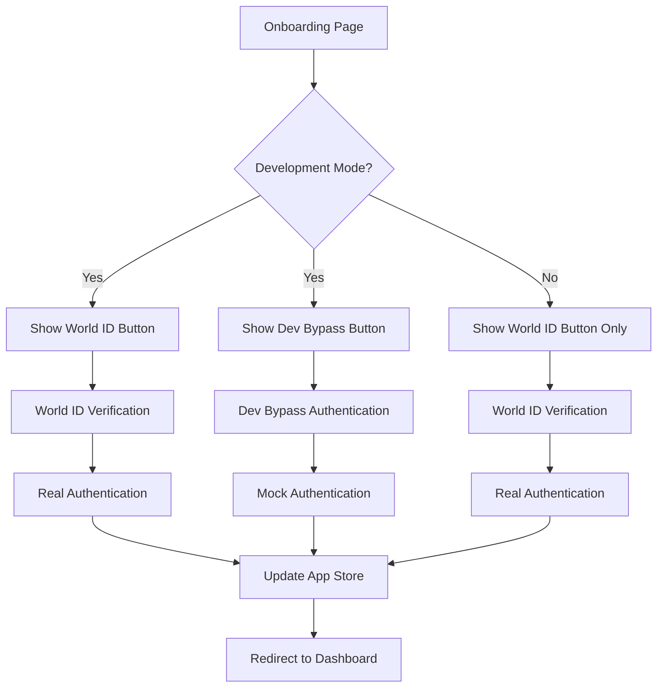

# World ID Integration with Dev Bypass Implementation Plan

## Overview

This document outlines the implementation plan for adding World ID integration with a development bypass feature to the GASH Swap MiniApp.

## Architecture Diagram



## Implementation Steps

### 1. Create World ID Integration Hook

File: `src/hooks/use-world-id.ts`

- Create a custom hook that handles both real and mock World ID verification
- Include functions for:
  - Real World ID verification (to be implemented later)
  - Mock verification for development
  - Environment detection (development vs production)

### 2. Update Onboarding Page

File: `src/app/onboarding/page.tsx`

- Add both World ID and Dev Bypass buttons
- Implement conditional rendering for Dev Bypass button (only in development)
- Integrate with the new use-world-id hook

### 3. Update App Store

File: `src/stores/app-store.ts`

- Ensure setUser action properly handles authenticated users
- Add any necessary state management for authentication flow

### 4. Environment Configuration

- Use existing `NEXT_PUBLIC_MOCK_MODE` environment variable or `NODE_ENV` to detect development mode
- Ensure Dev Bypass button only appears in development

## Detailed Implementation

### use-world-id.ts Hook

```typescript
import { useCallback } from 'react';
import { useAppStore } from '@/stores/app-store';
import { User } from '@/types';

export const useWorldId = () => {
  const { setUser, setLoading, setError } = useAppStore(state => ({
    setUser: state.setUser,
    setLoading: state.setLoading,
    setError: state.setError,
  }));

  // Mock authentication for development
  const mockAuthenticate = useCallback(async () => {
    setLoading(true);
    try {
      // Simulate API delay
      await new Promise(resolve => setTimeout(resolve, 1000));

      // Create mock user
      const mockUser: User = {
        id: 'mock-user-123',
        worldId: 'mock-world-id-456',
        wldBalance: 1000,
        gashBalance: 500,
        totalSwaps: 0,
        firstSwapCompleted: false,
        createdAt: new Date().toISOString(),
        updatedAt: new Date().toISOString(),
      };

      setUser(mockUser);
      return { success: true, user: mockUser };
    } catch (error) {
      const errorMessage =
        error instanceof Error ? error.message : 'Authentication failed';
      setError(errorMessage);
      return { success: false, error: errorMessage };
    } finally {
      setLoading(false);
    }
  }, [setUser, setLoading, setError]);

  // Real World ID verification (to be implemented)
  const verifyWorldId = useCallback(async () => {
    setLoading(true);
    try {
      // TODO: Implement real World ID verification
      // This would integrate with World ID SDK
      console.warn('Real World ID verification not yet implemented');
      setError('Real World ID verification not yet implemented');
      return { success: false, error: 'Not implemented' };
    } catch (error) {
      const errorMessage =
        error instanceof Error ? error.message : 'Verification failed';
      setError(errorMessage);
      return { success: false, error: errorMessage };
    } finally {
      setLoading(false);
    }
  }, [setLoading, setError]);

  return {
    mockAuthenticate,
    verifyWorldId,
    isDevelopment:
      process.env.NODE_ENV === 'development' ||
      process.env.NEXT_PUBLIC_MOCK_MODE === 'true',
  };
};
```

### Onboarding Page Update

```typescript
'use client';

import { useWorldId } from '@/hooks/use-world-id';
import { useRouter } from 'next/navigation';

export default function OnboardingPage() {
  const { mockAuthenticate, verifyWorldId, isDevelopment } = useWorldId();
  const router = useRouter();

  const handleWorldIdConnect = async () => {
    // TODO: Implement real World ID connection
    const result = await verifyWorldId();
    if (result.success) {
      router.push('/dashboard');
    }
  };

  const handleDevBypass = async () => {
    const result = await mockAuthenticate();
    if (result.success) {
      router.push('/dashboard');
    }
  };

  return (
    <div className="min-h-screen flex items-center justify-center p-4">
      <div className="card max-w-md w-full text-center">
        <h1 className="text-2xl font-bold text-gradient-gold mb-4">
          Welcome to GASH Swap
        </h1>
        <p className="text-dark-300 mb-6">
          Swap your Worldcoin (WLD) for synthetic gold-backed tokens (GASH)
        </p>
        <div className="space-y-4">
          <button
            className="btn-gold w-full"
            onClick={handleWorldIdConnect}
          >
            Connect with World ID
          </button>

          {isDevelopment && (
            <button
              className="btn-secondary w-full"
              onClick={handleDevBypass}
            >
              Dev Bypass (Mock Authentication)
            </button>
          )}
        </div>
      </div>
    </div>
  );
}
```

## Testing Plan

1. Verify Dev Bypass button only appears in development mode
2. Test mock authentication flow in development
3. Ensure real World ID button works in production
4. Verify proper error handling
5. Check redirect to dashboard after successful authentication

## Next Steps

Switch to Code mode to implement the actual code changes.
